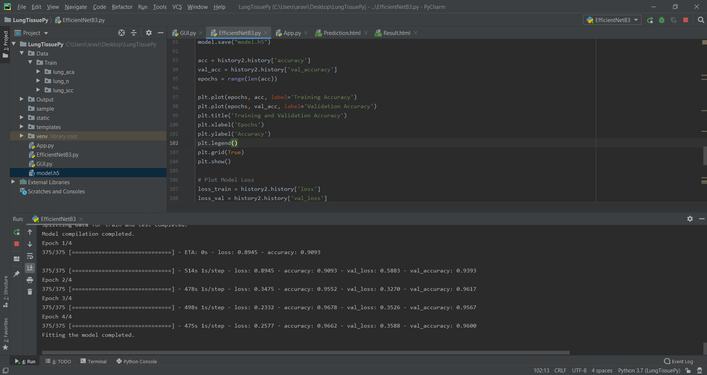
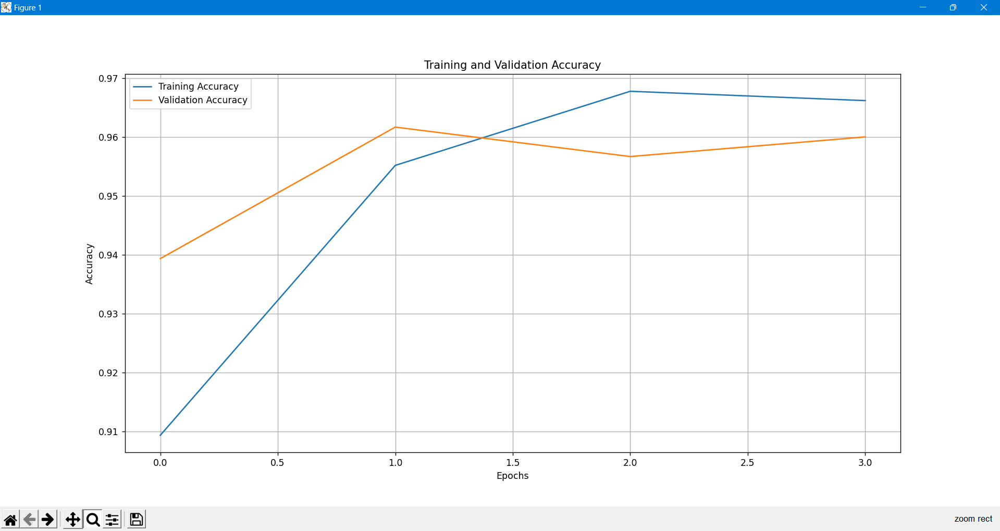
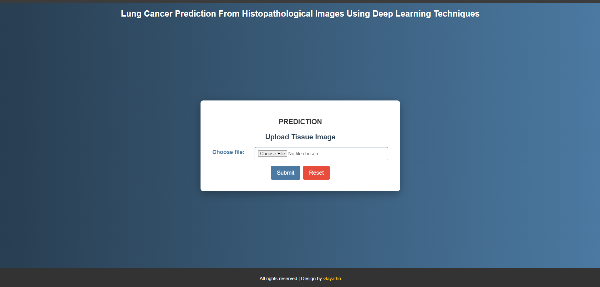
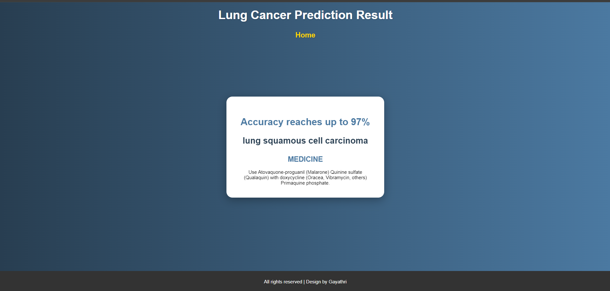
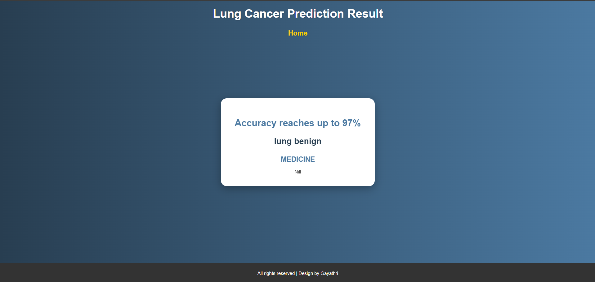
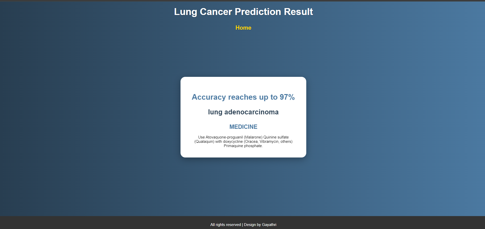

# Lung Cancer Prediction from Histopathological Images using Deep Learning Techniques

## Description
This project focuses on predicting lung cancer from histopathological images using deep learning techniques. The project is implemented in Python and leverages advanced machine learning algorithms to accurately classify images for cancer detection.

## Installation
### Prerequisites
- Python - 3.7.5
- pip
- numpy
- matplotlib
- tensorflow
- flask
- seaborn
- cv2 

## Screenshots
Here are some screenshots of the application:

### Fitting Model

### Training and Validation Accuracy

### Front_Page

### Prediction_Result_1

### Prediction_Result_2

### Prediction_Result_3

You're welcome! If you have any more questions or need further assistance, feel free to ask. Good luck with your Lung Cancer Prediction project!
